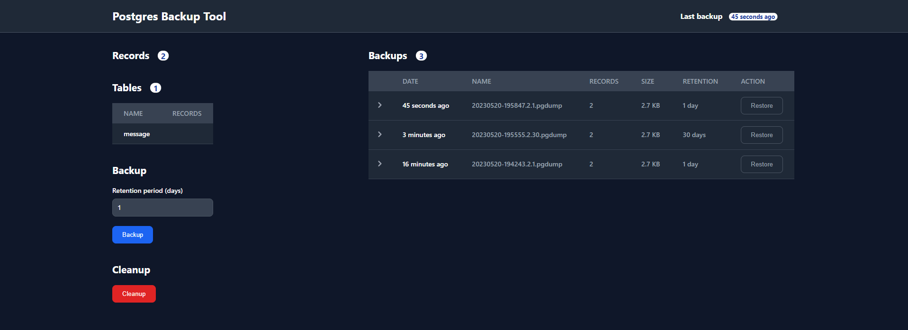

# postgres-backup-tool
Simple PostgreSQL backup tool to S3 Object Storage with UI

## Features
- List tables and records of actual database
- Show last backup time
- Create backups with retention period
- Cleanup expired backups
- Restore backups
- Exclude tables from backup
- Can be used without UI as REST API. For example using a cronjob and curl
- Fully covered with E2E Selenium tests
- Compatible with PostgreSQL 16
- Tested with Cloudflare R2 Object Storage

## Stack
- Java 17
- Spring Boot 3
- Web Components
- Lit 2.x
- Java AWS SDK 2.x 

## Required environment variables
- `AWS_S3_ENDPOINT_URL`
- `AWS_S3_ACCESS_KEY_ID`
- `AWS_S3_SECRET_ACCESS_KEY`
- `AWS_S3_BUCKET`
- `AWS_S3_REGION`
- `POSTGRES_HOSTNAME`
- `POSTGRES_PORT`
- `POSTGRES_DB`
- `POSTGRES_USER`
- `POSTGRES_PASSWORD`
- `SPRING_ACTUATOR_PORT`

## Optional environment variables

- `EXCLUDE_TABLES` - Comma-separated list of tables to exclude during backup

## Resources

- https://github.com/kananindzya/hello-world-aws-sdk-r2/blob/master/src/main/java/com/example/aws/api/r2/App.java
- https://github.com/esfandiar/vs-code-spring-boot-setup
- https://gist.github.com/valferon/4d6ebfa8a7f3d4e84085183609d10f14
- https://cwienczek.com/2020/06/simple-backup-of-postgres-database-in-kubernetes/
- https://developers.cloudflare.com/r2/examples/aws/boto3/
- https://boto3.amazonaws.com/v1/documentation/api/latest/reference/services/s3.html
- https://florianbuchner.com/kubernetes-curl-cronjob-for-internal-service/

- https://flowbite.com/docs/components/tables/
- https://hslpicker.com/

### Playwright for Java

- https://playwright.dev/java/
